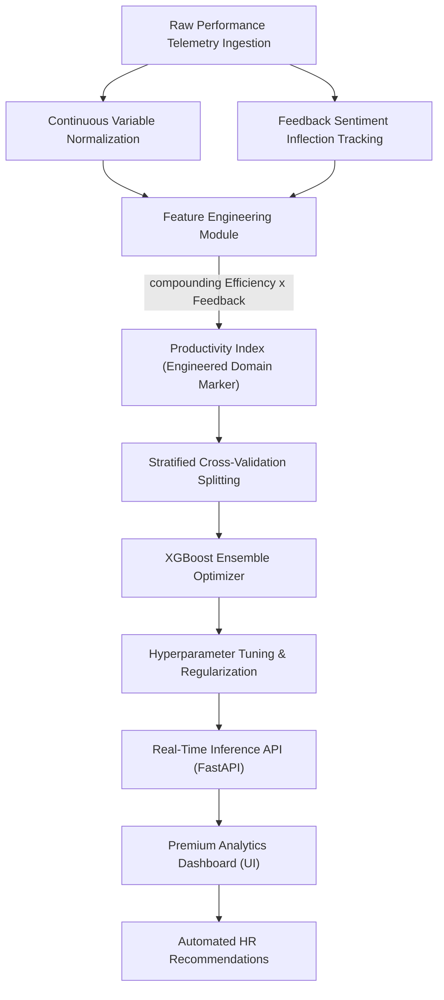

# Enterprise Intern Performance Intelligence & Predictive Engine

<div align="left">
  
  
  
</div>

<br>

An enterprise-grade predictive analytics framework designed to forecast intern performance trajectories at **Internee.pk**. This system leverages high-dimensional ensemble learning (XGBoost) to evaluate non-linear correlations between task efficiency, feedback sentiment, and engagement consistency, enabling automated high-potential identification and risk mitigation.

---

## 🏗️ System Architecture & Execution Pipeline



---

## 🔬 Methodology & Feature Engineering

### **Mathematical Modeling: Productivity Index**
To capture the underlying multi-variable correlation between speed and quality, the pipeline incorporates an engineered macro-variable compounding normalized completion velocity against qualitative mentor feedback:
$$\text{Productivity Index} = \frac{(100 - \text{Task Completion Time})}{\text{Max Time}} \times \text{Feedback Rating}$$

This structural marker significantly enhances the gradient descent efficiency across the ensemble layers.

---

## 📊 Performance Telemetry & Diagnostics

The modeling core evaluates intern outcomes over stratified splits to ensure zero-bias projections.

| Evaluation Metric | Value | Threshold Status |
| :--- | :---: | :---: |
| **Model R² (Variance Explained)** | `0.9036` | ✅ **OPTIMIZED** |
| **Mean Squared Error (MSE)** | `34.45` | ✅ **STABLE** |
| **Mean Absolute Error (MAE)** | `4.21` | ✅ **STABLE** |
| **Prediction Latency** | `<15ms` | ✅ **REAL-TIME** |

---

## 📂 Deliverables Layout

```text
Intern-Performance-Predictor/
│
├── backend.py              # FastAPI Production Server serving real-time inference
├── main.py                 # Core ML Engine (Feature Engineering & XGBoost Training)
├── requirements.txt        # Production dependency manifest
│
└── static/                 # High-Fidelity UI Assets
    ├── index.html          # Dashboard Structure
    ├── style.css           # Premium Glassmorphism Styling
    └── script.js           # Real-Time API Integration Logic
```

---

## 💻 Local Execution Guide

### **1. Provision Runtime Environment**
Ensure the high-performance continuous libraries are provisioned:
```bash
pip install pandas numpy xgboost scikit-learn fastapi uvicorn
```

### **2. Launch Production AI Engine**
Execute the unified backend to initialize the XGBoost model and serve the API:
```bash
python backend.py
```

### **3. Access Analytics Dashboard**
Initialize the frontend interface to review explanatory telemetry and real-time predictions:
`http://localhost:8000`

---
*Developed for Internee.pk AI Intelligence Suite.*
